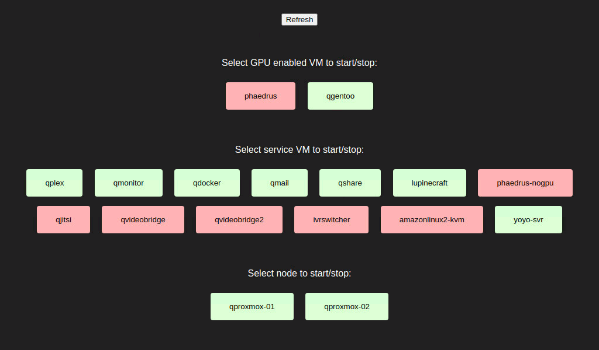

# vmupdown
vmupdown provides simple controls though an apache web site for Proxmox VMs & nodes. Specifically for my use case which is using a headless proxmox server as a workstation with multiple VMs sharing a single GPU and switching between them as required.

It uses Proxmoxer (https://github.com/proxmoxer/proxmoxer) with a Flask frontend to monitor status and control powering on/off VMs or nodes. It also includes basic detection of conflicts in VFIO pcie devices shared between VMs.

NB - Various assumptions on deployment platform are made in the below instructions, for reference the below relates to Ubuntu 21.10.

# Requirements:
APT:
 apache2 libapache2-mod-wsgi-py3 wakeonlan python3-pip
 PIP:
 flask proxmoxer requests

# Installation:
- Install requirements:
 apt install apache2 libapache2-mod-wsgi-py3 wakeonlan python3-pip
 pip3 -m install flask proxmoxer requests
- Configure apache2 to listen on port 8080:
 Add "Listen 8080" to /etc/apache2/ports.conf

- Copy vmupdown folder into /var/www/html and adjust permissions: 
chown -R www-data:www-data /var/www/html/vmupdown 
chmod +x /var/www/html/vmupdown/vmupdown.*

- Copy vmupdown.conf to /etc/apache2/sites-available and then enable site:
 a2ensite vmupdown

# Configuration:
- Create a proxmox pam user "vmupdown"
- Create a 'Role' in proxmox called 'vmupdown' and give it the following privileges:
 Sys.PowerMgmt, VM.Audit, VM.PowerMgmt
- Create 'Permissions' for both /nodes and /vms for the user and role above.
- Create and API Token for the vmupdown user. Copy the token into the token variable in vmupdown.py
- Fill out the rest of the variables at the top of the vmupdown.py file with values appropriate to your setup:
  
  nodes - a nested dictionary of nodes, mac addresses & status (NB. "status" should be left blank):
   e.g. {"proxmoxnode-01": {"mac": "70:85:c2:c7:29:b3", "status": ""}, "proxmoxnode-02": {"mac": "e0:d5:5e:5f:60:c2", "status": ""}}

  sharedgpu - the vfio number of your shared gpu, e.g. "0000:13:00"

- Reload apache:
 systemctl reload apache2

- You should now be able to load the site on http://serveripaddress:8080

 This is my first python project so any constructive suggestions are welcome!
